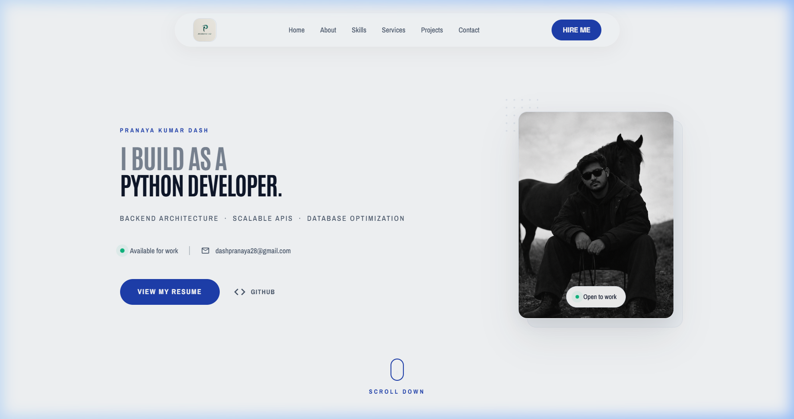
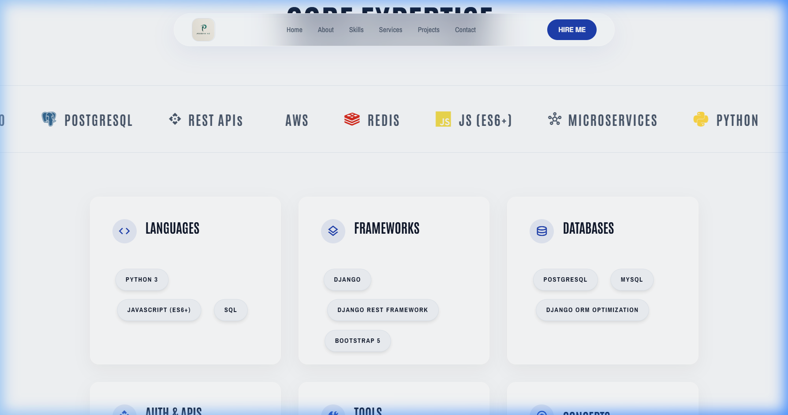
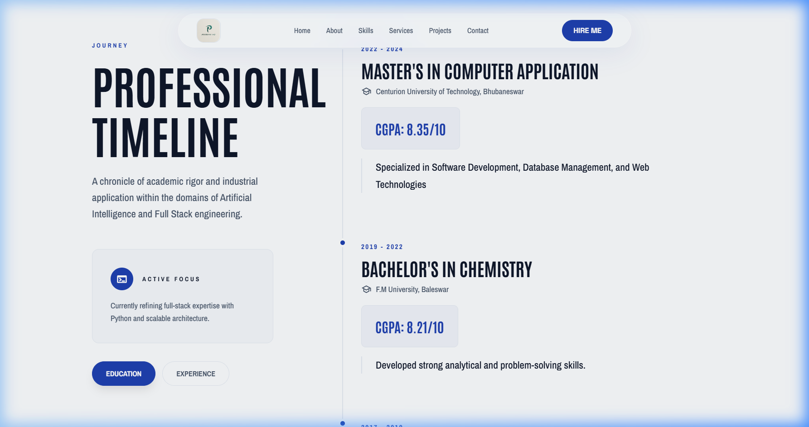
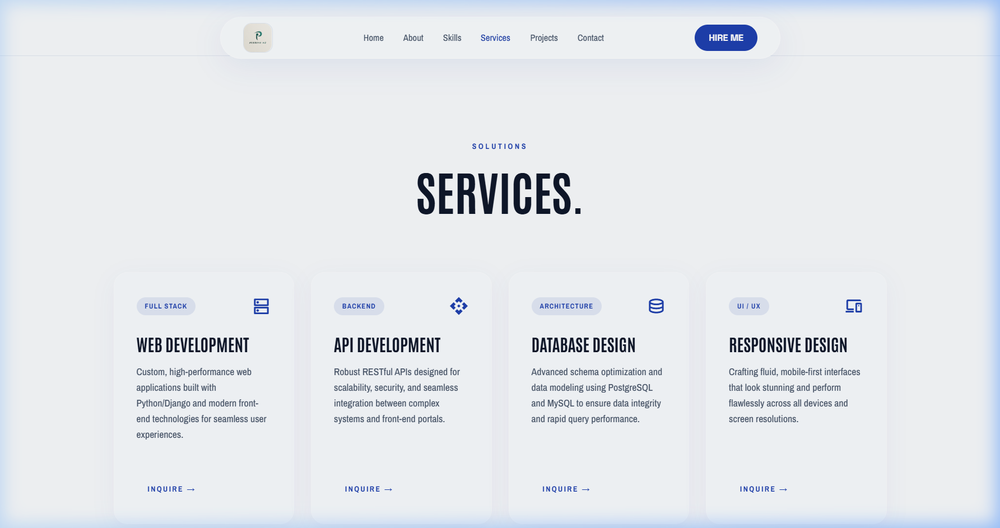
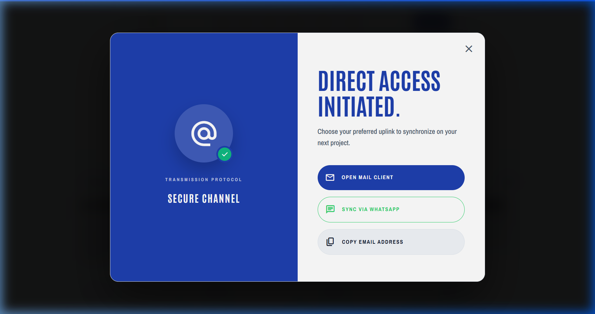

# Personal Portfolio – Pranaya Kumar Dash

Welcome to my personal portfolio! This website showcases my projects, skills, and experience as a Python Full-Stack Developer.

🔗 **Live Portfolio:** [https://pranayakd.github.io/Portfolio/](https://pranayakd.github.io/Portfolio/)

---

## 💎 The Elite Refactor (2026 Edition)

This portfolio has undergone a high-fidelity architectural and UI/UX overhaul. Key improvements include:
- **Modern Design System**: A customized "Cool Slate" aesthetic with sapphire accents and glassmorphism.
- **Mobile-First DNA**: Perfectly responsive layout with optimized touch targets and "Full-Bleed" mobile content.
- **High-End Interactivity**: GSAP-powered mouse parallax, smooth scroll (Lenis), and staggered entrance animations.
- **SEO & Data Mastery**: Integrated JSON-LD Schema Markup for professional indexing and a multi-channel "Hire Me" sync flow.

### 🖼️ Visual Showcase

#### **Hero Section & Interactive Parallax**

#### **Technical Faculties (Core Expertise)**

#### **Professional Timeline & Journey**

#### **Services & Capabilities**

#### **High-Tech "Hire Me" Modal**

## About Me

I am a passionate Python Full-Stack Developer with expertise in:

- **Backend:** Python, Django, Flask  
- **Frontend:** HTML, CSS, JavaScript  
- **Data Analysis & Visualization:** pandas, matplotlib, seaborn  
- **Databases:** MySQL, PostgreSQL, MongoDB  

I enjoy building dynamic applications, analyzing data, and solving real-world problems.

---

## Projects

### 1. Customer Segmentation & Product Profitability Analysis
- Analyzed customer behavior and product profitability to help marketing decisions.
- Technologies: Python, pandas, matplotlib, seaborn, Jupyter Notebook
- Repository: [GitHub Link](https://github.com/PranayaKD/Customer-Segmentation-Product-Profitability-Analysis)

### 2. Data Analytics Dashboard
- Built an interactive web dashboard for real-time data visualization.
- Technologies: Flask, pandas, Chart.js, MongoDB

*(Add more projects as needed)*

---

## Contact

📧 Email: dashpranaya28@gmail.com  
🔗 LinkedIn: [https://www.linkedin.com/in/pranayakd28](https://www.linkedin.com/in/pranayakd28)  
🐙 GitHub: [https://github.com/PranayaKD](https://github.com/PranayaKD)
